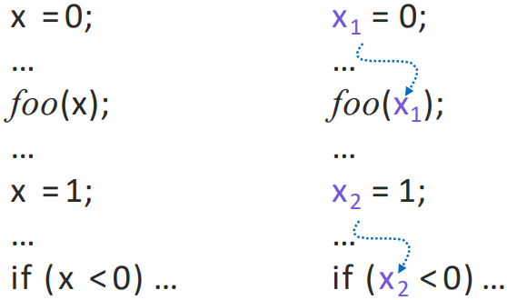
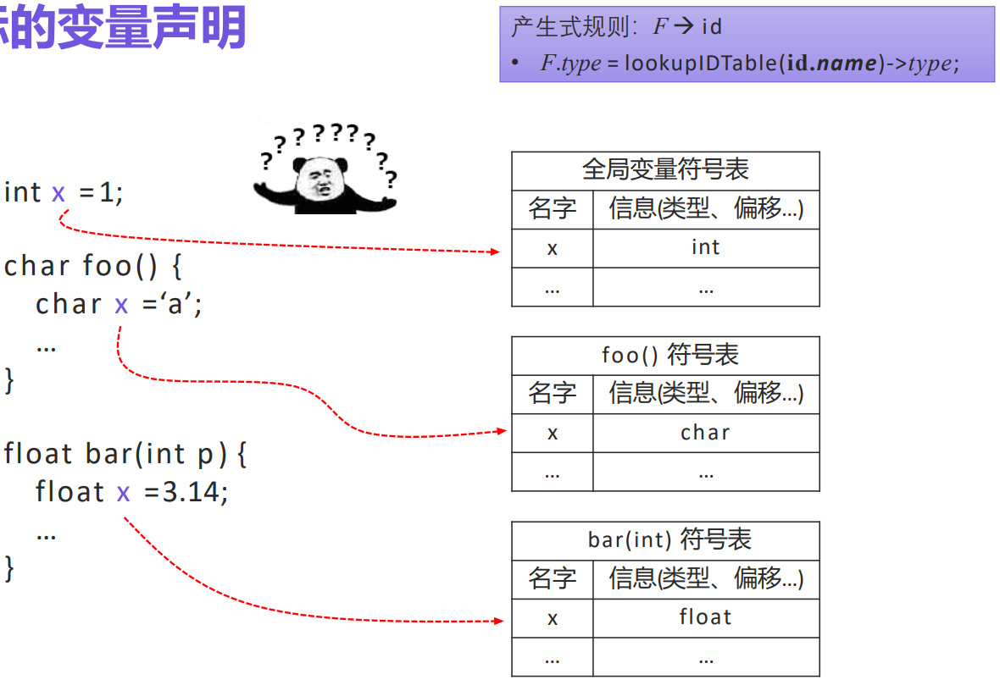

# 中间代码生成
## 一、 语法树变体
- 有向无环图：DAG，Directed Acyclic Graph
### 1.1 表达式的有向无环图 
- 与语法树类似：一个叶子结点对应于原子运算分量，内部节点对应于运算符
- 与语法树不同：DAG中的一个结点N可能有多个父结点，这个结点N表示一个公共子表达式
- 例子：a + a*(b-c) + (b-c)*d (从右到左)
  
- 构建过程：与构建语法树类似，但是在创建结点时先检查是否存在符合要求的结点，有则直接使用

### 1.2 构建DAG的值编码方法
- 语法树或DAG图中的结点存放在一个记录数组中
- 第一个字段是一个运算符代码或标号
- 各个叶子结点还有一个附加的字段，存放标识符的词法值(指向符号表的指针或一个常量)
- 内部节点有两个附加字段，分别指明左右子结点
- 值编码：在这个数组中，可以根据数组的整数下标引用该对应结点，这个整数就称为该节点的值编码(实践中可以用记录指针或对象引用代替整数下标)
  

- 构造DAG的结点的值编码方法
  - 输入：标号$op$、结点 $l$ 和结点$r$
  - 输出：数组中具有三元组$<op, l, r>$形式的结点的值编码
  - 方法：在数组中搜索标号为$op$、左子节点为$l$且右子结点为$r$的结点$M$。如果存在这样的结点，则返回结点$M$的值编码。若不存在这样的结点，则在数组中添加一个结点$N$，其标号为$op$，左右子结点分别为$l$和$r$，返回新建节点对应的值编码
- 可以使用散列表的结构存储结点，提高结点的搜索效率

## 二、三地址码
- 一条指令的右侧最多有一个运算符
- **简单的翻译表达式算法往往会为赋值运算生成复制指令**
- 目标：
  -  接近大多数目标机器的**执行模型** (机器码)
  -  支持大多数目标机器提供的**数据类型和操作**
  -  提供有限度的、高于机器码的**抽象表达能力**，更容易表达出大多数 (命令式) 高级语言的特性
-  特征：
   - 以指令为单位
   - 每条指令只有有限数量的运算分量(通常$\leq$3)
   - 支持基本数据类型及其运算
   - 支持复合数据类型 (如数组、结构体) 及其操作
   - 支持函数
### 2.1 地址和指令
- 地址的形式：名字(源程序的名字)、常量、编译器生成的临时变量：
- 常见三地址指令形式：
  - 赋值指令：$x=y$
  - 运算 / 赋值指令：$x=y\space op\space z$
  - 无条件转移指令：$goto \space L$
  - 条件转移指令：$if \space x \space goto \space L \qquad if \space not \space x \space goto \space L$
  - 条件转移指令：$if \space x \space relop \space y \space goto \space L$
  - 过程调用 / 返回：
    $param \space x_1$// 设置参数
    $param \space x_2$
    $...$
    $param \space x_n$
    $call \space p,n$// 调用子过程$p$，$n$为参数个数
  - 带下标的赋值指令：$x=y[i]\quad x[i]=y$// $i$表示离开数组位置的第$i$个**字节**，并非数组的第$i$个元素
  - 地址 / 指针赋值指令：$x=\&y \quad x=*y \quad *x=y$ 
- 在实现时，可使用 **四元式 / 三元式 / 间接三元式 / 静态单赋值** 来表示三地址指令

### 2.2 四元式表示
- 格式(字段)：$op \quad arg_1 \quad arg_2 \quad result$
  $op$：运算符的内部编码
  $arg_1，arg_2，result$：地址 
  例：$x=y+z$，四元式：$+ \quad y \quad z \quad x$
- 单目运算符和简单赋值语句不使用 $arg_2$
- $param$运算不使用 $arg_2$ 和 $result$
- 条件转移 / 非条件转移将目标标号放在 $result$ 字段
- 数组操作的四元式
  - 读数组：$x=y[i]$
  - 写数组：$x[i]=y$
  
- 例子：$a = b * − c + b * − c$
   

### 2.3 三元式表示
- 字段：$op$、$arg_1$、$arg_2$
- 三元式中，使用运算$x \space op \space y$的位置来表示它的结果，而不像四元式中使用一个显式的临时名字表示。
- 数组操作的四元式需要两个条目
  - $x[i]=y$：把 $x$ 和 $i$ 置于一个三元式中，把 $y$ 置于另一个三元式中，通过赋值指令连接
  - $x=y[i]$：看成 $t=y[i]$ 和 $x=t$ 两条指令
- 例子：$a = b * − c + b * − c$
   
- 优化编译器往往需要移动指令位置，此时三元式就不利于处理，指令的位置还蕴含着变量

- 间接三元式
  - 包含一个指向三元式的指针的列表，而不是列出三元式序列本身
  - 例子：
      
  - 优化编译器可以对instruction列表进行重排序以移动指令位置，但不影响三元式本身

- **注意有关数组、函数的三地址码的书写规则**

### 2.4 静态单赋值形式
- 所有赋值都针对具有不同名字的变量(所有变量在代码中只被赋值**一次**)
- 基本构造思路
  - 为每个变量维护一个计数器
  - 从函数入口开始遍历函数体
  - 遇到变量赋值时，为其生成新名字，并替换
  - 将新变量名传播到后续相应的使用处，并替换
  
- 通常只针对函数内的变量 (即局部变量) 计算SSA，全局变量的SSA在实际当中难以计算
- SSA分支：在分支汇合处插入$\varphi$语句，对于同一个变量$x$在不同路径中被赋值的情况，使用$x_i=\varphi(x_j, x_k, … )$来合并不同的赋值
   
- SSA循环：循环被翻译成分支与跳转语句的组合，直接按照相应语句的方式处理
   
- 作用：
  - 每个变量只被赋值一次，相当于都变成const变量
  - 简化了数据流分析和某些优化
  - 使得定义-使用链易于计算
    - 关联每个变量的定义(赋值)及其相应的使用
       
    - 许多分析和优化所需的关键信息
    - SSA行驶中，定义-使用关系非常清晰，且可以线性复杂度进行计算 
      

## 三、类型和声明
- 类型检查：利用一组规则来检查**运算分量**的类型和**运算符**的预期类型是否匹配
- 类型信息的作用：查错、确定名字 (对应的数据) 所需的内存空间、计算数组元素的地址、类型转换、选择正确的运算符
- 考虑在某个过程或类中声明的名字的类型及存储空间布局问题(相对地址，一个名字或某个数据结构分量的相对地址是指它相对于数据区域开始位置的偏移量)

### 3.1 类型表达式
- 类型分类
  - 基本类型：程序设计语言中的原子类型，通常这些类型的运算都有对应的机器指令
  - 复合类型：由基本类型或其它复合组合而成，为程序设计语言提供更强的抽象和表达能力
    - 数组、结构体、函数
- 类型自身具有结构，使用类型表达式表示这种结构
  - 基本类型：类型名字
  - 复合类型：通过**类型构造算子**作用于类型表达式得到
- 数组类型：表示同类型的聚合
  - 类型结构算子array，两个参数：
    - 数字：表示数组的长度
    - 类型：表示数组元素的类型
  - 例子：int[2][3] —— array(2, array(3, integer))
- 记录类型：表示不同类型数据的聚合 (结构体、类)
  - 类型构造算子record，有多组字段
    - 字段名：可用于在记录中引用该字段
    - 类型：字段对应数据的类型
  - 记录的基本构造算子是笛卡尔积×
    - 若s，t是类型表达式，其笛卡尔积s×t也是类型表达式
    - 在记录类型的构造中起组合作用
      - 组合字段名与相应类型
      - 组合多组字段
  - 例子：struct { int a[10]; float f; } st; —— record((a × array(10, int)) × (f × float))

- 函数类型：表示程序中函数的类型
  - 类型构造算子→，接收参数类型与返回值类型，并构造出函数类型
  - 例子：int foo(float x, long[5] y ) { … } —— (float × array(5, long)) → int

### 3.2 类型等价
- 判断两个类型是否等价
  - 类型检查的基础
  - 不同的语言有不同的类型等价的定义
  - 当语言允许为自定义类型命名时，主要有两类等价性判定方式
- 名等价(Name Equivalence)
  - 类型表达式t与u等价当且仅当它们对应的**类型名字**相同
- 结构等价(Structure Equivalence)
  - 对于基本类型，比较它们名字是否相同
  - 对于复合类型，比较类型构造算子；若相同，(递归) 比较构造算子的各参数分量

### 3.3 声明
- 处理基本类型、数组类型或记录类型的文法
  
  - $D$——生成一系列声明
  - $T$——生成基本类型、数组类型或记录类型
  - $B$——生成基本类型 int 和 float
  - $C$——生成声明数组的格式
- 应用该文法及其对应的语法制导定义，除了得到类型表达式之外，还得进行各种类型的存储布局

### 3.4 局部变量名的存储布局
- 变量的类型可以确定变量在运行时需要的内存
  - 为每个名字分配一个**相对地址**，名字的类型和相对地址信息保存在相应的**符号表条目**中
  - 可变大小的数据结构(字符串、动态数组)只需要考虑为指针保留一个已知的固定大小的存储空间
- 存储区域是连续的字节块，字节是可寻址的最小内存单位。多字节数据对象往往被存储在一段连续字节中，并以初始字节的地址作为该数据对象的地址。
- 地址对齐：数据对象的存储布局受目标机器的寻址约束的影响，将整数相加的指令往往希望整数能够对齐。
  - 假设机器希望地址能够被4整除。对于一个10字符的数组，编译器会为其分配12字节，这样会留下2字节的补白(padding)。
  - 当空间比较宝贵时，编译器需要对数组进行压缩，此时不存在补白，但需要在运行时刻执行额外的指令把被压缩的数据重新定位，以便使这些数据看上去是对齐的。
- 类型宽度：类型的一个对象所需的存储单元的数量
- 计算类型和宽度的SDT
  - 综合属性：type, width 
    - 全局变量 $t$ 和 $w$ 用于将类型和宽度信息从 $B$ 传递到 $C \rightarrow \epsilon$
    - 相当于 $C$ 的继承属性 (也可以把 $t$ 和 $w$ 替换为 $C.t$ 和 $C.w$)

   
  - 例子：int[2][3]
     

### 3.5 声明的序列
- 实际上声明会发生在不同的作用域
  
- 在处理一个过程/函数时，局部变量应该放到该过程/函数对应的符号表中
- 这些变量的内存布局独立：相对地址从0开始，变量的放置和声明的顺序相同
- 声明序列的SDT：
   
  - 变量$offset$记录当前可用的**相对地址**,每分配一个变量，$offset$增加相应的值 (加宽度)
  - $top.put(id.lexeme, T.type, offset)$
    - top指向当前函数的符号表
    - 在符号表中创建条目，记录标识符的**类型**和**偏移量**
- 例子：
  

### 3.6 记录和类中的字段
- 记录变量声明的翻译方案，约定：
  - 一个记录中各个字段的名字必须互不相同
  - 字段名的偏移量 (相对地址)，是相对于该记录的数据区字段而言的
- 记录类型使用一个**专用的符号表**，对其各个字段的类型和相对地址进行单独编码
- 记录类型$record(t)
  - record是类型构造算子
  - t 是符号表对象，保存该记录类型各个字段的信息
- Env环境
  - 当程序中的作用域发生嵌套时，用一个栈Env辅助维护各作用域对应的符号表，栈中存储指向各符号表的指针
    - 进入一个新作用域时，保存上一作用域 (压栈)
    - 从一个作用域退出时，恢复上一作用域 (出栈)
   
- 声明序列SDT补充
  - 记录类型存储方式可以推广到类
  

## 四、表达式的翻译
