# 语法分析
## 一、上下文无关文法
### 1.1 定义：上下文无关文法由终结符号、非终结符号、开始符号、产生式组成
- 终结符号：又称“语法单元名字”，是组成串的基本符号
- 非终结符号：表示串的集合的语法变量
- 开始符号：被指定的某个非终结符号
- 产生式：产生式头(左部) → 产生式体(右部)
  - 产生式头：
  - 符号$\rightarrow$：有时可用::=代替
  - 产生式体：描述产生式头所对应的串的某种构造方式

### 1.2 符号约定
- 终结符号：靠前的小写字母、运算符号、标点符号、数字、黑体字符串
- 非终结符号：靠前的大写字母、S(常表示开始符号)、小写&斜体名字、讨论程序语言构造时的大写字母
- 文法符号(终结/非终结)：靠后的大写字母
- (或为空的)终结字符串：靠后的小写字母
- (或为空的)文法符号串：小写希腊字母
- 可选体：$A \rightarrow \alpha_1|\alpha_2|...|\alpha_k$，$\alpha_i$称为A的可选体
- 一般而言，第一个产生式的头就是开始符号

### 1.3 推导：从开始符号出发，每个重写步骤把一个**非终结符号**替换为它的某个产生式的体
- 推导符号
  - $\Rightarrow$：通过一步推导出
  - $\overset{*}\Rightarrow$：通过零步或多步推出
    - $\alpha \overset{*}\Rightarrow \alpha$
    - 若$\alpha \overset{*}\Rightarrow \beta$且$\beta \overset{*}\Rightarrow \gamma$，则$\alpha \overset{*}\Rightarrow \gamma$
   - $\overset{+}\Rightarrow$：通过一步或多步推出
- 推导定义
  - 句型：若$S \overset{*}\Rightarrow \alpha$，则$\alpha$是G的一个句型。终结符号/非终结符号/空串
  - 句子：不包含非终结符号的句型
  - 语言：文法G生成的所有句子的集合，记为L(G)
    
- 推导过程
  - 最左推导：总选择每个句型的最左非终结符符号替换，$\alpha \underset{lm} \Rightarrow \beta$，所得句型称为最左句型
  - 最右推导(规范推导)：总选择每个句型的最右非终结符符号替换，$\alpha \underset{rm} \Rightarrow \beta$，，所得句型称为最右句型

### 1.4 语法分析树与推导
- 推导的图形表示形式，每个内部节点代表一个产生式的应用，
- 内部节点表示一个产生式头，其子结点从左到右组成产生式体
- 叶子结点可以是终结符号，也可以是非终结符号；从左到右排列叶子结点可以得到一个句型，称为这棵树的结果或边缘
- 一棵语法分析树可对应多个推导序列。但只有**唯一**的最左推导及最右推导

### 1.5 二义性：一个文法可以为某个句子生成多棵语法分析树，即对同一个句子有多个最左推导或最右推导
- 需要制定规则消除二义性

### 1.6 验证文法生成的语言
  - 推断一个给定的产生式集合生成了某些特定的语言
**此处跳过了，书上有一个例子**

### 1.7 上下文无关文法和正则表达式
- 文法的表达能力比正则表达式强：文法 $\geq$ 正则表达式
  - 正则表达式描述的构造都能用文法来描述，但反之不成立
  - 有穷状态机不能无限计数($a^ib^i,i \geq$1)

## 二、设计文法
- 文法能够描述程序设计语言的**大部分**语法，剩余需要语义分析完成
  - 标识符的先声明后使用
  
### 2.1 词法分析与语法分析
- 和文法相比，正则表达式更加简洁且易于理解
- 根据正则表达式自动构造的词法分析器的效率高于根据任意文法自动构造得到的分析器

### 2.2 消除二义性
- 有时二义性文法可以被改写成无二义性的文法
- 二义性根源：多种“正确”推导处于文法同一层
- 惯用技术：分层
  - 将真正想要的推导提取出来，放到更深的层次
  - 在最左推导中，多种“正确”推导处于文法同一层；分层后确保只有一种最左推导
- 悬空-else：见纸质

### 2.3 左递归的消除
- 左递归：某个文法存在一个非终结符号A，使得：$A \overset{+}\Rightarrow A\alpha$ 
- 直接(规则)左递归：$A \Rightarrow A\alpha$
  - 消除方法：
    - 原：$A \rightarrow A\alpha_1|...|A\alpha_m|\beta_1|...|\beta_n$
    - 后：$A \rightarrow \beta_1 A'|...|\beta_n A'$ &emsp; $A' \rightarrow \alpha_1 A'|...|\alpha_m A'|\epsilon$  
- 间接左递归：
  - 文法：$S \rightarrow Aa|b$ &emsp; $$A \rightarrow Ac|Sd|\epsilon$
  - 左递归推导：$S \Rightarrow Aa \Rightarrow Sda$
  - 消除间接左递归：
    - 条件：文法中不存在环($A \overset{+}\Rightarrow A$)或$\epsilon$产生式($ A \rightarrow \epsilon$)
    - 算法：**看纸质,PPT上没有**
       

### 2.4 提取左公因子
- 产生适用于预测分析技术或自顶向下分析技术的文法
- 算法
  - 输入：文法G
  - 输出：等价的提取了左公因子的文法
  - 方法：对于每个非终结符号A，找出其某些选项之间的最长公共前缀$\alpha$
    将  
    &emsp; $A \rightarrow \alpha\beta_1|...|\alpha\beta_n|\gamma$  
    替换为   
    &emsp; $A \rightarrow \alpha A'|\gamma$ &emsp; $A' \rightarrow \beta_1|...|\beta_n$ 


### 2.5 非上下文无关文法的构造
**略**

## 三、自顶向下的语法分析
- 可看做从语法分析树的根结点开始，按照先根顺序创建语法树各节点的过程；也可看做寻找输入串的**最左**推导过程

### 3.1 递归下降的语法分析
- 每个非终结符号对应于一个过程/函数，该过程负责扫描此非终结符号对应的结构
  - $S \rightarrow ...$ bool S() {...}
  - $A \rightarrow ...$ bool A() {...}
  - $B \rightarrow ...$ bool B() {...}
- 程序执行从开始符号对应的过程开始
  - 当扫描整个输入串时宣布分析成功完成
- 不同产生式对应的过程：
  - $A \rightarrow t$，t是终结符
    ```python
    bool A()
    {
        if nextToken is t
            consume nextToken;
            return true;
        return false;
    }
    ```
  - $A \rightarrow XYZ$
    ```python
    bool A()
    {
        if X() && Y() && Z()
            consume nextToken;
            return true;
        return false;
    }
    ``` 
  - $A \rightarrow X|Y|Z$
    ``` python
    bool A()
    {
        // 需要回溯以撤销已识别的语法结构
        if X() return true;else backtrack;
        if Y() return true;else backtrack;
        if Z() return true;else backtrack;
        return false;
    }
    ```
  - 左递归文法会使递归下降进入无限循环(**函数的死递归**)
- 优：易于实现 
- 缺：需要回溯(影响效率)

### 3.2 FIRST和FOLLOW
- FIRST($\alpha$)：可从$\alpha$推导出的串的首符号集合，$\alpha$为任意文法符号串
  - 若$\alpha \overset{*}\Rightarrow \epsilon$，则$\epsilon$也在FIRST($\alpha$)中
  - 计算规则：X——文法符号
    - 若X是终结符号：则FIRST(X) = X
    - 若X是非终结符号，且$X \rightarrow Y_1Y_2...Y_k$(k$\geq$1)，则
      对于i $\leq$ k，若FIRST($Y_j$)( j < i )中都有$\epsilon$( 即$Y_j \overset{*}\Rightarrow \epsilon$ )，则将FIRST(Y_i)中的所有元素a加入FIRST(X)中
    - 若$X \rightarrow \epsilon$是一个产生式，则将$\epsilon$加入FIRST(X)中
     
- FOLLOW(A)：可能在某些句型中紧跟在A右边的终结符号的集合
  - 计算规则：**不断重复直至收敛**
    - 将\$放入到FOLLOW(S)中，S——开始符号，\$——输入右端的结束标记
    - 若存在一个产生式$A \rightarrow \alpha B \beta$，则FIRST($\beta$)中**除 $\epsilon$ 外**的所有符号都在FOLLOW(B)中
    - 若(存在一个产生式$A \rightarrow \alpha B$)或(存在产生式$A \rightarrow \alpha B \beta$ 且 FIRST($\beta$)包含$\epsilon$)，则FOLLOW(A)中的所有符号都在FOLLOW(B)中

### 3.3 LL(1)文法
- 定义：LL(k)
  - 第一个L：left-to-right 从左到右扫描
  - 第二个L：left-most 最左推导
  - k: 向前看k个符号
    - 实践当中，通常k=1，即LL(1)
- 限制条件：
  - 文法的任意两个不同产生式$A \rightarrow \alpha | \beta$都满足：
    - 不存在终结符号a使得α和β都可推导出以a开头的串
    - α和β最多只有一个可推导出空串
    - 若β可推导出空串，则α不能推导出以FOLLOW(A) 中任何终结符号开头的串
  - 等价于：
    - FIRST(α)与FIRST(β)不相交(条件一、二)
    - 若$\epsilon \in$ FIRST($\beta$)，那么FOLLOW(A)与FIRST(α)不相交(**这一条与构造预测分析表相关**)

- 算法：利用FIRST与FOLLOW构造预测分析表
  - 输入：文法G
  - 输出：预测分析表M
    - 二维表，非终结符 (行) × 终结符 (列) → 产生式
    - 展开非终结符时，根据输入终结符选择相应产生式
  - 方法：对于文法(G)的每个产生式$A \rightarrow \alpha$
    - 对于FIRST($\alpha$)中的每个终结符号a，将$A \rightarrow \alpha$加入到M[A,a]中
    - 若$\epsilon \in$FIRST($\alpha$)，对于FOLLOW(A)中的每个终结符号b，将$A \rightarrow \alpha$加入到M[A,b]中
    - 若$\epsilon \in$FIRST($\alpha$)且\$ $\in$FOLLOW(A)，将$A \rightarrow \alpha$加入到M[A,\$]中
  - 最后在所有的空白条目中填入error(书中用空白表示)
  - 存在左递归与二义性的文法会导致一个空填入两条产生式
    - 悬空else

### 3.4 非递归的预测分析
- 分析表驱动的语法分析器：模拟最左推导
  - 一个输入缓冲区
    - 包含要分析的串，最后跟有结束符号$
  - 一个分析表
  - 一个包含了文法符号序列的栈
    - 若$w$是至今为止已完成分配的输入部分，，则栈中保存的文法符号序列$\alpha$满足：$S \underset{lm}{\overset{*}\Rightarrow}   w \alpha$
    - 初始化时，栈中仅包含开始符号S(和$)，此处复用\$标记栈底，\$上方是S

  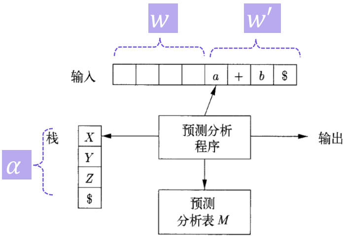
  - 算法：
    - 输入：一个串$w$，文法G的预测分析表M
    - 输出：如果$w$在L(G)中，输出$w$的一个最左推导；否则给出一个错误提示
    - 方法：
      ```C++
      设置ip指向的第一个符号，ip为输入指针
      令 X = 栈顶符号
      while(S != $)// 栈非空
      {
        if(X==ip所指向的符号a) 执行栈的弹出操作，将ip向前移动一个位置;
        else if(X是一个终结符号) error();// 
        else if(M[X,a]是一个报错条目) error();
        else if(M[X,a] == X → Y_1Y_2...Y_k)  
        {
            输出产生式X → Y_1Y_2...Y_k;
            弹出栈顶符号;
            将Y_k, Y_k-1, ..., Y_1压入栈中，Y_1位于栈顶;
        }
        令 X = 栈顶符号;
      } 
      ```
      
      
- 局限性：
  - 根据极为有限的信息预测 (猜) 产生式
  - 能识别的文法有局限性
    - 需要改造文法消除左递归
    - 改造后的文法不直观
    - 生成的语法树不易理解和处理

## 四、自底向上的语法分析
- 对应从叶子结点(底部)开始逐渐向上到达根结点(顶部)的构造语法树过程
- 自底向上语法分析的通用框架：移入-规约
- 多种LR技术：简单LR技术(SLR)、向前看LR技术(LALR)

### 4.1 规约
- 自底向上的语法分析过程可以看成是从串w归约为文法开始符号S的过程
- 一个与某产生式体相匹配的特定子串被替换为该产生式头部的非终结符号
- 归约过程相当于一个反向的最右推导
- 关键：
  - 何时进行规约
  - 使用哪个产生式进行规约

### 4.2 句柄
- **最右句型中**和某个产生式体 (右部) 相匹配的子串，对它的归约代表了该最右句型的最右推导的最后一步
  - 但和某个产生式匹配的最左子串不一定是句柄
- 定义：
  - 对于最右句型$\alpha \beta w$，若$S \underset{rm}{\overset{*}\Rightarrow} \alpha Aw \underset{rm}\Rightarrow \alpha\beta w$，则$A\rightarrow\beta$(简写为$\beta$)是$\alpha \beta w$的一个句柄
- 最右句型中，句柄右边只有终结符
- 若文法无二义性，则每个句型有只有一个句柄
- 自底向上分析的过程就是识别和归约句柄的过程

### 4.3 移入-规约语法分析技术
- 使用一个栈来保存归约/扫描移入的文法符号
- 用一个缓冲区存放将要进行语法分析的其余符号
- 分析过程简述：
  - 开始时刻：栈中只包含$，而输入为w$
  - 结束时刻：栈中为S$，而输入为$
  - 在分析过程中，不断移入符号，并在识别到句柄时进行归约
    - 句柄被识别时总是出现在栈的**顶部**
- 移入-规约分析器的四种操作：
  - 移入：将下一个输入符号移入到栈顶
  - 规约：将句柄归约为相应的非终结符号
    - 句柄总是在栈顶
    - 具体操作时弹出句柄，压入被归约到的非终结符号
  - 接受：宣布分析过程成功完成
  - 报错：发现语法错误，调用错误恢复子程序
- 此处可以使用栈的原因是：**句柄总是出现在栈顶**
  - 证明见书P151
  - 直观理解：如果一个句柄出现在栈中/底，那它之前就应该被归约了

### 4.4 移入-归约分析中的冲突
- 即使知道栈中所有内容、以及后续k个输入符号,仍然有可能存在冲突
  - 移入-规约冲突：无法判断进行规约还是移入
  - 规约-规约冲突：无法判断按照哪个产生式进行规约
- 移入-规约冲突：
  - 悬空-else：可通过在碰到else时强制移入以解决，此时if与最临近的else相匹配
- 规约规约冲突：**详见书P152**

## 五、 LR语法分析技术介绍：简单LR技术
- LR(k)
  - L表示最左扫描，R表示反向构造出最右推导
  - k表示最多向前看k个符号
  - k表示在语法分析时向前看k个输入符号
    - k = 2时，程序语言的语法分析器的规模通常非常庞大
    - 当k = 0, 1时，已经可以解决很多语法分析问题，因此具有实践意义

### 5.1 LR语法分析器的优点
- 适用范围广：对于几乎所有的程序设计语言，只要写出上下文无关文法，就能够构造出识别该语言的LR语法分析器
- 高效：采用最通用的无回溯移入-归约分析技术
- 谨慎：对输入从左到右进行扫描时可以尽早检测到错误
- 优于LL(k)：能分析的文法比LL(k)文法更多
- 由表格驱动，虽然手工构造表格工作量很大，但表格可以自动生成

### 5.2 项和LR(0)自动机
- LR(0)项：一个文法产生式 + 其中某处的一个点
  - 类似词法分析DFA的状态
  - 例子：$A \rightarrow \cdot XYZ  \quad A \rightarrow X\cdot YZ \quad A \rightarrow XY\cdot Z \quad A \rightarrow XYZ\cdot$
  - $A\rightarrow\alpha\cdot\beta$表示：已扫描/归约到了$\alpha$，并期望在接下来的输入中经过扫描/归约得到$\beta$，然后把$\alpha\beta$归约到A
  - $A\rightarrow\alpha\beta\cdot$表示：已扫描/归约得到了αβ，可以把αβ归约为A
  - 产生式$A\rightarrow \epsilon$只生成一个项$A \rightarrow \cdot$

- 项集
  - 项的集合，用来表示语法分析过程中所处的位置
  - 表示：用一个整数对表示
    - 第一个整数基础文法的产生式编号
    - 第二个整数是点的位置
    - “闭包”项的点位于产生式的开始处，可以根据项集内的其他项重新构造出来，故不必包含在内
  
- 规范LR(0)项集族
  - 可用于构造一个确定有穷自动机——LR(0)自动机，自动机的每个状态代表规范LR(0)项集族的一个项集
  - 增广文法：G的增广文法G'是在G中增加新开始符号S'，并加入产生式S' → S而得
    - 目的1：告诉语法分析器何时停止语法分析并宣称接受输入符号串
      - 当使用$S'\rightarrow S$进行规约时，输入符号串被接受
    - 目的2：方便引入S的项
      - 识别的起始——$S' \rightarrow \cdot S$，识别的结束——$S' \rightarrow S\cdot$
  - 项集闭包(CLOSURE)：
    - 构造规则：如果I是文法G的一个项集，CLOSURE(I)就是根据下列两条规则从I构造得到的项集
      - 将I中的各项加入CLOSURE(I)中
      - 若$A\rightarrow \alpha\cdot B\beta$在CLOSURE(I)中，而$B\rightarrow\gamma$是一个产生式，且项$B\rightarrow\cdot\gamma$不在CLOSURE(I)中，
        则将项$B\rightarrow\cdot\gamma$加入CLOSURE(I)中，**不断应用该规则直至收敛**
    - 意义：$A\rightarrow\alpha\cdot B\beta$表示希望看到由$B\beta$推导出的串，这个串的某个前缀可从B推导而得，必然用到了某个B产生式，故加入各个B产生式对应的项
    - 构造算法
      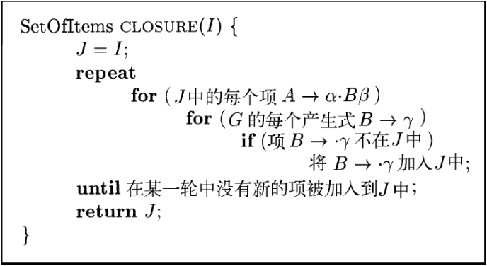
    - 内核项与非内核项：
      - 内核项：包括初始项$S'\rightarrow S$及点不在最左端的所有项
      - 非内核项：除$S'\rightarrow S$外点在最左端的所有项
      - 如果点在最左端的某个B产生式被加入I的闭包中，那么所有B产生式都会被加入到这个闭包中，故有时不必把所有I中的$B\rightarrow \cdot\gamma$列出，只需记录左部的非终结符即可
      - 求闭包加入的项一定是非内核项，故可抛弃所有非内核项，用很少内存保留更加有用的内核项  
       
  - GOTO函数：相当于有限状态机的状态跳转表
    - I是一个项集，X是一个文法符号，则GOTO(I, X)定义为I中所有形如[$A\rightarrow \alpha\cdot X\beta$]的项所对应的项[$A\rightarrow \alpha X\cdot\beta$]的集合的闭包
    - GOTO(X,I)表示当输入为X时离开状态I的转换
  - 构造规范LR(0)项集族：从初始项集开始，不断计算各种可能的后继，直至生成所有项集
    - 输入：增广文法G'
    - 输出：跳转表GOTO(以及相应项集闭包)
    - 方法：
      项集族.jpg)
    - **状态机是逐步构建的，从$S\rightarrow\cdot S$开始不断通过CLOSURE和GOTO找到新项集**
  
- LR(0)自动机
  - 构造方法：
    - 基于规范LR(0)项集族可以构造LR(0)自动
    - 规范LR(0)项集族中的每个项集对应于LR(0)自动机的一个状态
    - 状态转换：如果GOTO(I, X) = J，则从 I 到 J 有一个标号为 X的转换
    - 开始状态为CLOSURE({ $S'\rightarrow\cdot S$ })对应的项集
  - 思想：假设文法符号串$\gamma$使LR(0)自动机从开始状态运行到状态(项集)j
    - 若 j 中存在项$A\rightarrow\alpha\cdot$，则
      - $\alpha$是$\gamma$的后缀，且是该句型的句柄(对应产生式$A\rightarrow\alpha$)
      - 表示**可能**找到了当前最右句型的句柄，可以**规约**
      - 在γ之后添加一些终结符号可以得到一个最右句型
    - 若 j 中存在项$B\rightarrow \alpha\cdot X\beta$，则
      - 该句型中$\alpha X\beta是句柄$，但还没找到，还需**移入**
      - 在γ之后添加Xβ和一些终结符号可以得到一个最右句型
  - 用法：
    - 在移入时，根据原栈顶状态和移入符号，查询GOTO，得到新的状态
    - 在规约时，根据归约产生式的右部长度弹出相应状态(右部长度为N则弹出N个状态)，再根据此时栈顶状态获取新的状态
      - 规约相当于**先弹出，再移入**

### 5.3 LR语法分析算法
- LR语法分析器结构
  - **根据栈顶状态和当前输入，通过分析表确定下一步动作**
  - 栈用以存储状态序列
  - 语法分析表：ACTION + GOTO
    - ACTION表项：
      - 两个参数：状态i + 终结符号a/输入结束标记$
      - ACTION[i,a]的四种形式：
        - 移入 j：j 是新状态，把 j 压入栈 (同时移入a)
        - 归约$A\rightarrow\beta$：把栈顶的β归约为A (并根据GOTO表项压入新状态)
        - 接受：接受输入，完成分析
        - 报错：在输入中发现语法错误
    
    - GOTO表项：把项集上的GOTO函数拓展为状态集上的函数 
      - 如果GOTO[$I_i$, A] = $I_j$，那么GOTO[i, A] = j

- LR语法分析器格局：栈中内容 + 余下输入
  - ($s_0s_1...s_m , a_ia_{i+1}...a_n\$$)
    - 第一个分量是栈中内容(右侧$s_m$是栈顶)
    - 第二个分量是剩余输入，注意输入最后有一个$
  - LR语法分析器的每一个状态都对应一个文法符号 ($s_0$除外)
    - $s_0$为开始状态，不代表任何文法符号
    - 如果状态$s_{i-1}$读取符号X跳转到状态$s_i$，那么$s_i$就对应于X
    - 令$X_i$为$s_i$对应的符号，那么$X_1X_2…X_ma_ia_{i+1}…a_n$对应于一个最右句型

- LR语法分析器的行为：主要依据语法分析表
  - 对于格局($s_0s_1...s_m , a_ia_{i+1}...a_n\$$)，LR语法分析器查询条目ACTION[$s_m$, $a_i$]确定相应的动作
    - ACTION[$s_m$,$a_i$] = 移入s：执行移入动作，将状态s (对应输入$a_i$) 移入栈中，得到新格局 ($s_0s_1…s_ms，a_{i+1}…a_n\$$)
    - ACTION[$s_m$,$a_i$] = 归约$A \rightarrow \beta$：将栈顶的$\beta$归约为A，压入状态s，得到新格局 ($s_0s_1…s_{m-r}s，a_ia_{i+1}…a_n\$$)，其中r是$\beta$的长度，状态s= GOTO[$s_{m-r}$, A]
    - ACTION[$s_m$,$a_i$] = 接受：语法分析过程完成
    - ACTION[$s_m$,$a_i$] = 报错：发现语法错误，调用错误恢复例程
- LR语法分析算法
  - 输入：文法G的LR语法分析表，输入串$w$
  - 输出：如果$w$在L(G)中，则输出自底向上语法分析过程中的归约步骤，否输出错误指示
  - 方法：
    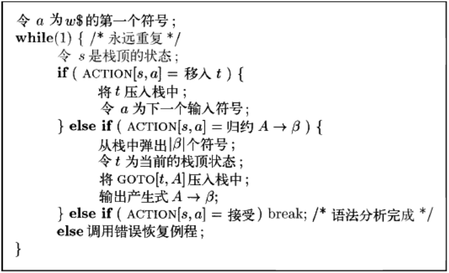 
  - 符号约定
    - si：移入并将状态si压栈
    - rj：按照编号为j的产生式进行规约(产生式事先进行编号)
    - acc：表示接受
    - 空白：表示报错

### 5.4 构造SLR(Simple LR)语法分析表
- 以LR(0)自动机为基础的SLR语法分析表构造算法
- 输入：一个增广文法G'
- 输出：G'的SLR语法分析表函数ACTION和GOTO
- 方法:
  - 构造增广文法G'的LR(0)项集规范族{$I_0$, $I_1$, …, $I_n$ }
  - 根据$I_i$得到状态i，相关ACTION/GOTO表条目如下：
    - 若[$A\rightarrow\alpha\cdot a\beta$]在$I_i$中，且GOTO($I_i$,a) = $I_j$
      则ACTION[i, a] = “移入j”，**a必须是终结符号**
    - 若[$A\rightarrow\alpha\cdot $]在$I_i$中
      则对**FOLLOW(A)**中所有a，ACTION[i, a] = “按$A\rightarrow\alpha$规约”
    - 若[$S'\rightarrow S\cdot$]在$I_i$中，则将ACTION[i,\$]设为“接受”
    - 若GOTO($I_i$,A)=$I_j$，则在GOTO表中，GOTO[i,A]= j
  - 空白条目设为“error”
  - 若SLR分析表没有冲突，该文法就是SLR(1)/SLR的
- 思想：把$\alpha$归约成为A，后面需是FOLLOW(A)中的终结符号，否则只能移入
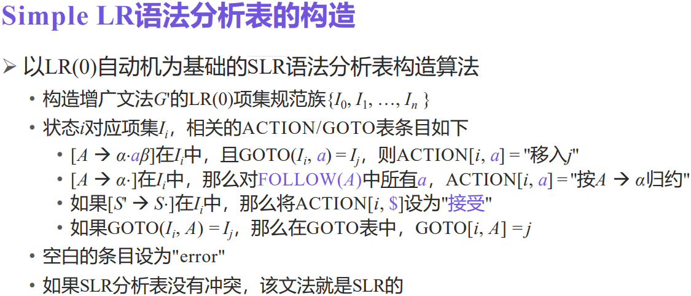  

### 5.4 可行前缀
  - 定义：一个最右句型的前缀，并且它没有越过该最右句型的最右句柄的右端
    - 某些最右句型的前缀永远无法到达，因为一旦得到某个句柄就直接规约了
    - 在可行后缀后加入某些终结符号就可以得到最右句型
  - 有效项：若存在一个推导过程$S\overset{*}{\underset{rm}\Rightarrow}\alpha Aw\underset{rm}\Rightarrow \alpha\beta_1\beta_2 w$，就说项$A\rightarrow\beta_1\beta_2$对于可行前缀$\alpha\beta_1 $有效
    - 根据有效项，LR(0)自动机就能做出移入-规约决定
      - 若$\beta\neq\epsilon$，说明句柄没有被全部移入至栈中，选择移入
      - 若$\beta=\epsilon$，则$A\rightarrow\beta_2$看起来是句柄，应该按这个产生式进行规约
      - 可能有两个有效项要求对同一个可行前缀做不同的事情，其中部分冲突可以通过查看下一个输入符号解决(LR(1))

## 六、更强大的LR语法分析器
- 规范LR方法(LR方法)
  - 添加项[$A \rightarrow\cdot\alpha$]时，把期望的向前看符号也加入到项中，成为LR(1)项集
  - 向前看符号(串)的长度即为LR(k)中的k
  - 状态很多

- 向前看LR(LALR方法)
  - 基于LR(0)项集族，但每个LR(0)项都带有向前看符号
  - 分析能力强于SLR，且分析表与SLR一样大
  - LALR已经可以处理大部分的程序设计语言
### 6.1 规范LR(1)项
- 形式：[$A\rightarrow\alpha\cdot\beta$，a]，$A\rightarrow\alpha\beta$是一个产生式，而a是一个终结符号或者右端结束标记$
- 有效性：
  - LR(1)项[$A\rightarrow\alpha\cdot\beta$，a]对于一个可行前缀$\gamma$有效的条件是存在一个推导$S\overset{*}{\underset{rm}\Rightarrow}\delta\alpha\underset{rm}\Rightarrow\delta\alpha\beta w$，其中
    - $\gamma$=$\delta\alpha$，且
    - a为$w$的第一个符号 或 $w$为$\epsilon$且a为$

### 6.2 构造LR(1)项集
- 输入：一个增广文法G'
- 输出：LR(1)项集族，其中的每个项集对文法G'的一个或多个可行前缀有效
- 方法：只需改写LR(0)的CLOSURE和GOTO过程
  - CLOSURE：注意在添加[$B\rightarrow\cdot\gamma$，b]时，b的取值范围
    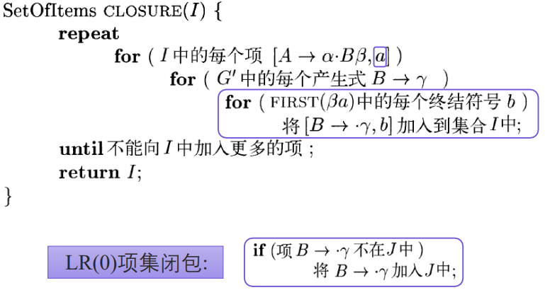
  - GOTO： 和LR(0)项集的GOTO算法基本相同
    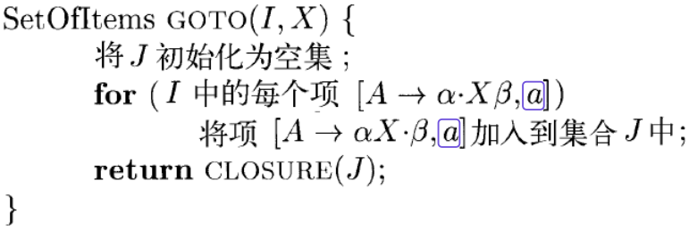 
  - LR(1)项集族的构造算法：与LR(0)项集族的构造算法相同
    项集族.jpg) 
  - **状态机是逐步构建的，从$S\rightarrow\cdot S$开始不断通过CLOSURE和GOTO找到新项集**

### 6.3 规范LR(1)语法分析表
- 构造规范LR(1)语法分析表
  - 输入：一个增广文法G'
  - 输出：G'的规范LR语法分析表的函数ACTION和GOTO
  - 方法：
    - 构造得到LR(1)项集族C' = {$I_0$, $I_1$, …, $I_n$ }
    - 语法分析器的状态i根据$I_i$构造得到。状态i的语法分析动作的确定规则：
      - 若[$A\rightarrow\alpha\cdot a\beta$，b]在$I_i$中，并且GOTO($I_i$，a) = $I_i$，则将ACTION[ i，a]设为“移入 j”，a为终结符号
      - 若[$A \rightarrow\alpha\cdot$，a]在$I_i$中，则将ACTION[ i，a]设为“按照$A\rightarrow\alpha$规约”  
      - 若[$S' \rightarrow S$，\$]在$I_i$中，则将ACTION[ i，\$]设为“接受”
      -  若上述规则产生冲突动作，则该文法不是LR(1)的
    - GOTO表项：若GOTO($I_i$,A) = $I_j$，则GOTO[ i, A] = j
    - 没有填写的条目为“报错”(error)
    - 语法分析器的初始状态是由包含[$S'\rightarrow\cdot S$，$]的项集构造得到的状态  
 
    语法分析表.jpg) 

### 6.4 构造LALR语法分析表
- 对比：
  - SLR(1)语法分析表的分析能力较弱
  - LR(1)语法分析表的状态数量很大
  - LALR(1)是实践中常用的方法
    - LALR(1)是实践中常用的方法
    - 能够方便地处理大部分常见程序设计语言的构造

- 核心：项集的核心就是第一分量的集合
  -  一个LR(1)文法可能产生具有多个相同核心的项集
  -  GOTO(I,X)的核心只由I的核心决定，故一组被合并的项集的GOTO目标也可以被合并
-  合并具有相同核心的状态不会产生出新的移入-规约冲突，因为移入动作仅由核心决定，无需考虑向前看符号。但是可能会产生新的规约-规约冲突。

- 简单但空间需求大的LALR分析表构建方法
  - 输入：一个增广文法G'
  - 输出：文法G'的LALR语法分析表函数ACTION和GOTO
  - 方法：
    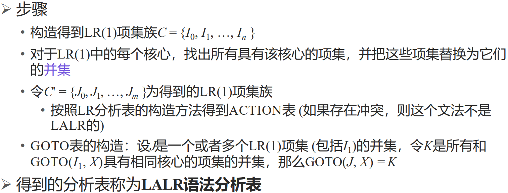 

- 当处理错误的输入时，LALR可能多执行一些归约动作才发现错误，但不会多移入一个符号

### 6.5 高效构造LALR语法分析表的方法
- 向前看符号的类型：自发生成、非自发生成(传播得来)
  - 自发生成
    项集I包含内核项[$A\rightarrow\alpha\cdot\beta $，a]，且 J = GOTO(I,X)
    若**不管a为何值**，GOTO(CLOSURE({$A\rightarrow\alpha\cdot\beta $})，X)中总包含[$B\rightarrow\gamma\cdot\delta $，b]
    则对于$B\rightarrow\gamma\cdot\delta $，b是自发生成的
    - 特殊情况：
      - 向前看符号\$对于初始项集中的项[$S'\rightarrow\cdot S$]而言是自发生成的。
  - 传播
    项集I包含内核项[$A\rightarrow\alpha\cdot\beta $，a]，且 J = GOTO(I,X)
    若**a=b**，且GOTO(CLOSURE({$A\rightarrow\alpha\cdot\beta $})，X)中包含[$B\rightarrow\gamma\cdot\delta $，b]的原因是项$A\rightarrow\alpha\cdot\beta$中有一个向前看符号b
    则称向前看符号从I的内核中的$A\rightarrow\alpha\cdot\beta$传播到了J的内核中的$B\rightarrow\gamma\cdot\delta$

- 确定向前看符号
  - 输入：一个LR(0)项集I的内核K以及一个文法符号X
  - 输出：由I中的项为GOTO(I,X)中内核项自发生成的向前看符号，以及I中将其向前看符号传播到GOTO(I,X)中内核项的项
  - 方法：
    for(K中的每个项$A\rightarrow\alpha\cdot\beta$);
    &emsp;&emsp;J := CLOSURE({[$A\rightarrow\alpha\cdot\beta $，#]})
    &emsp;&emsp;&emsp;&emsp;if( [$B\rightarrow\gamma\cdot X\delta$，a] 在J中，并且a不等于#)
    &emsp;&emsp;&emsp;&emsp;&emsp;&emsp;断定GOTO(I,X)中的项$B\rightarrow\gamma X\cdot\delta$的向前看符号a是自发生成的;
    &emsp;&emsp;&emsp;&emsp;if( [$B\rightarrow\gamma\cdot X\delta$，#] 在J中)
    &emsp;&emsp;&emsp;&emsp;&emsp;&emsp;断定向前看符号从I中的项$A\rightarrow\alpha\cdot\beta$传播到了GOTO(I,X)中的项$B\rightarrow\gamma X\cdot\delta$之上;

- LALR(1)项集族的内核高效计算方法
  - 输入：一个增广文法G'
  - 输出：文法G'的LALR(1)项集族的内容
  - 方法：
    1. 构造G的LR(0)项集族的内核。
        - 若空间不紧张，可以先构造出LR(0)项集，再删除非内核项 
        - 若空间紧张，可只保留各项集的内核项，并在计算GOTO之前求闭包
    2. 将确认向前看符号的算法应用于每个LR(0)项集的内核和每个文法符号X，确定GOTO(I,X)中的那些向前看符号是自发生成的，并确定哪些向前看符号从I的哪个项传播到GOTO(I,X)的哪个内核项上 
    3. 初始化表格，给出每个项集中的每个内核项相关的向前看符号。最初只包含步骤2中确定为自发生成的符号。
    4. 不断扫描所有项集的内核项。访问一个内核项i时，使用步骤(2)中得到的、用表格表示的信息，确定i将它的向前看符号传播到哪些内核项中。项i的当前向前看符号集合被加到和这些被传播的内核项相关联的向前看符号集合中。**不断扫描内核项直至没有新的向前看符号被传播为止**。

### 6.6 LR语法信息表的压缩
- 压缩动作字段技术的一个原理：动作表中通常有很多相同的行
- 为每个状态创建一个指向一维数组的指针，可节省可选空间，并且付出的时间代价却很小。
  - 具有相同动作的状态的指针指向相同位置
  - 为每个终结符号赋予一个编号(0到终结符号的数目-1)，对于每个状态这个编号将成为从指针值开始的偏移量
  - 在一个给定的状态中，第i个终结符号对应的语法分析动作可以在该状态的指针值之后的第i个位置上找到
- 为每个状态创建一个动作列表，可以获取更高的效率，但语法分析会变慢。
  - 这个列表由(终结符号，动作)对组成。
  - 一个状态最频繁的动作可以放在列表的结尾处，并**将终结符号设为any**，表示不管输入是什么，都选择该动作
  - 为使一行中的内容更加一致，可把报错条目安全地替换为规约动作。对错误的检测会稍有延后，但仍可在下一个移入动作前发现错误。
- 可把GOTO表编码为一个列表，但更高效的方法是为每个非终结符号A构造一个数对的列表。
  - A的列表中的每个对的形式为：GOTO[当前状态，A] = 下一状态。
  - 这技术有用，因为GOTO表的一列中常常只有很少几个状态，
- GOTO表中的报错条目从不被查询到，故可把每个报错条目替换为该列中最常用的非报错条目，以进一步减少使用的空间。这个条目成为默认选择，当前状态设为any

## 七、使用二义性文法
- 每个二义性文法都不是LR的
- 二义性文法可以提供更短、更自然的规约；也可以隔离经常出现的语法构造
- 虽然使用二义性文法，但是需要给出消除二义性的规则，使每个句子只有一棵语法分析树

### 7.1 用优先级和结合性解决冲突
- +和*的优先级与结合性

### 7.2 悬空-else冲突
- 强制在遇到else移入else
- 或者修改文法，增加else的深度

### 7.3 LR语法分析中的错误恢复
- 查询ACTION表时可能发现报错条目
  - 假设栈中的符号串为$\alpha$，当前输入符号为a，报错表示不可能存在终结符号串x使得$\alpha$ax是一个最右句型
- 恐慌模式的错误恢复策略
  - 基本思想：假定当前试图归约到A但碰到了语法错误，因此设法扫描完包含语法错误的A的子串，假装找到了A的一个实例
  - 从栈顶向下扫描，找到状态s，s有一个对应于某个非终结符号A的GOTO目标 (s之上的状态被丢弃)
  - 在输入中丢弃一些符号，直到一个可以跟在A之后的符号b (不丢弃b)，并将GOTO(s, A)压栈，继续进行分析

- 短语层次的恢复
  - 检查LR分析表中的每个报错条目，根据语言的特性来确定程序员最可能犯了什么错误，然后构造适当的恢复程序 

## 八、补充
### 8.1 语法错误的处理
- 错误难以避免，编译器需要有处理错误的能力
- 程序中可能存在不同层次的错误
  - 词法错误、语法错误、语义错误、逻辑错
- 语法分析器中错误处理程序的设计目标
  - 清晰准确地报告出现的错误，并指出错误的位置
  - 能从当前错误中恢复，以继续检测后面的错误
  - 尽可能地减少开销
### 8.2 错误恢复
- 恐慌模式的恢复：一旦发现错误就不断丢弃输入中的符号，一次丢掉一个符号，直至找到同步词法单元集合中的某个元素为止。
  - 同步词法单元：通常是界限符(如：分号或 })
    - 文法符号A的同步集合的启发式规则
      - 终结符
        - 将FOLLOW(A)中所有符号放入A的同步集合中
        - 将高层次非终结符号对应串的开始符号加入到较低层次非终结符号的同步集合
          - 比如：语句的开始符号，if/while等可作为表达式的同步集合
        - 将FIRST(A)中的符号加入到A的同步集合 
        - 碰到这些符号时，可能意味着前面的符号是多余的符号
        - 如果A可以推导出空串，把该产生式当作默认值
      - 非终结符
        - 在栈顶的终结符号出现匹配错误时，可直接弹出该符号，并且发出消息称已经插入了这个终结符号
  - 简单，且不会进入无限循环。
- 短语层次的恢复：当发现一个错误，语法分析器在余下的输入上进行局部性纠正，即将余下的输入的某个前缀替换成另一个串，使语法分析得以继续。
  - 在预测语法分析表的空白条目中插入错误处理例程的函数指针
  - 替换、删除、插入
- 错误产生式：预测可能遇到的常见错误，在文法中加入特殊的产生式。当使用了某个错误产生式，则说明检测到预期错误。
- 全局纠正：在理想情况下，希望编译器在处理一个错误输入串时通过最少的改动将其转化为语法正确的串。而寻找一个最小的改动序列的算法在时间和空间上的开销较大

### 8.3 YACC/Bison
- 使用方法
  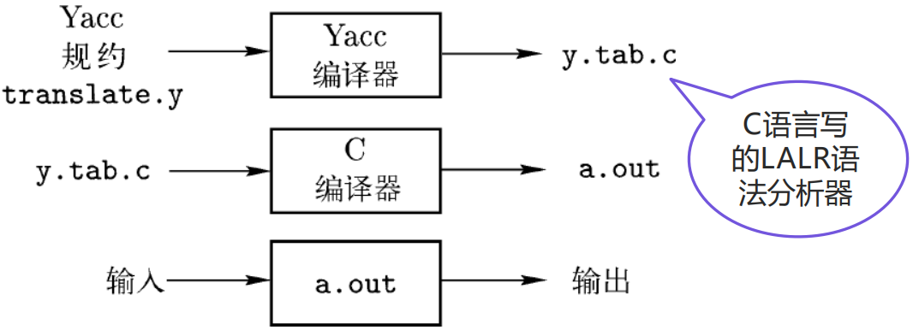

- 程序结构
  - 声明：放置C声明和对词法单元的声明
  - 翻译规则：指明产生式及相关的语义动作
  - 辅助性C语言例程：
    - 被直接拷贝到生成的C语言源程序中
    - 可在语义动作中调用
    - 包括yylex()，该函数返回词法单元，由Lex生成
  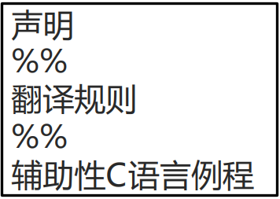

- 翻译规则的格式
  - 第一个产生式的头被看作开始符号
  - 语义动作是C语句序列
  - \$\$表示和产生式头相关的属性值，$i(**从1开始计数**)表示产生式体中第i个文法符号的属性值
  - 在按照某个产生式归约时，执行相应的语义动作，可以根据$i来计算$$的值
  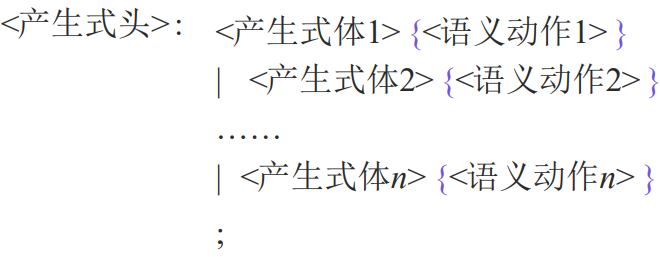 

- YACC例子
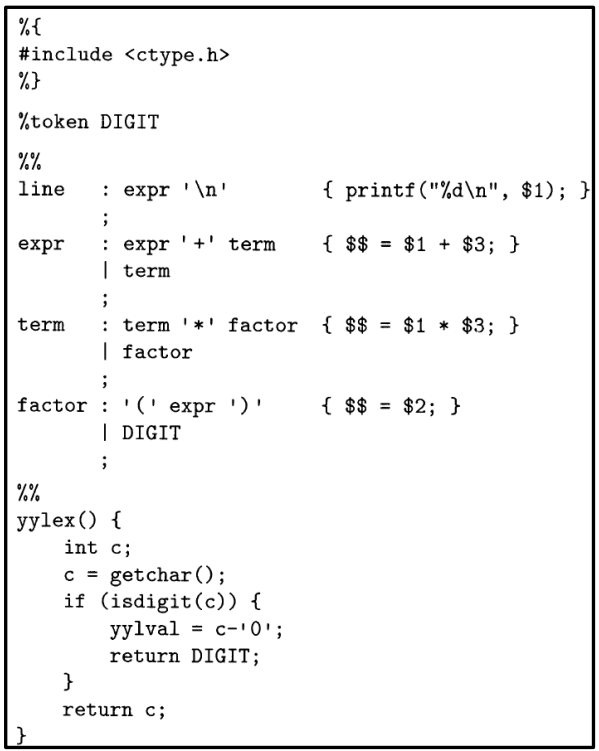

- 冲突处理
  - 缺省处理方法
    - 归约/移入冲突：总是移入 (悬空else的解决)
    - 归约/归约冲突：选择列在前面的产生式
    - 选项-v可在文件y.output中看到冲突的描述和解决方法
  - 通过确定终结符号的优先级/结合性来解决冲突
    - 结合性：%left, %right, %nonassoc
    - 移入a/按A → α归约：比较a和A → α的优先级再选择
      - 终结符号的优先级按在声明部分的出现顺序而定
      - 产生式的优先级设为它最右的终结符号的优先级，也可以加标记%prec <终结符号>，指明产生式的优先级等同于该终结符号

- 错误恢复
  - 使用错误产生式来完成语法错误恢复
  - 定义哪些非终结符号有错误恢复动作
    - 比如：表达式、语句、块、函数定义等非终结符号
  - 当语法分析器遇到错误时
    - 不断弹出栈中状态，直到栈顶状态包含项$A \rightarrow \cdot error \alpha$
    - 分析器将error移入栈中
    - 如果α为空，分析器直接执行归约，并调用相关的语义动作；否则跳过一些符号，找到可以归约为α的串为止