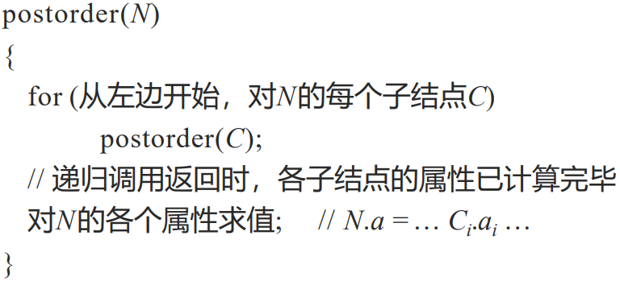
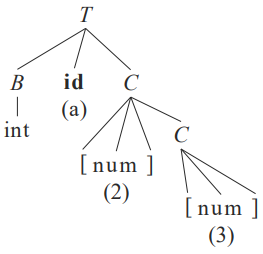
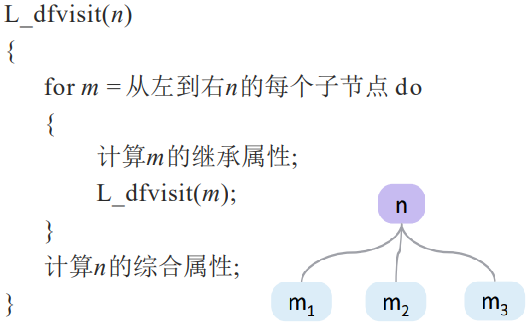
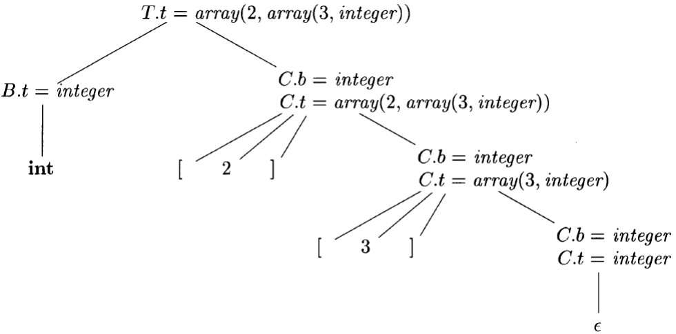
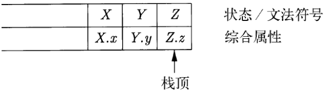
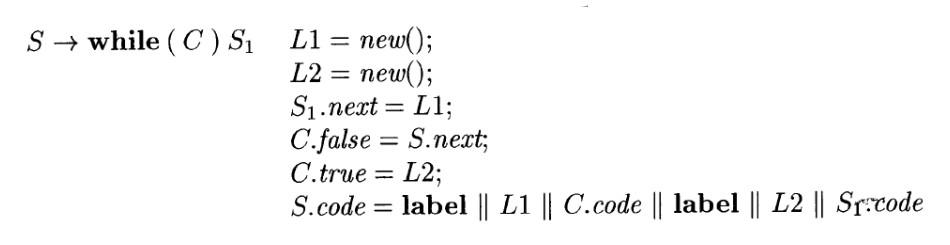
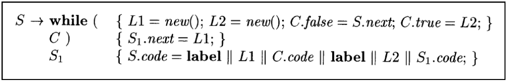

# 语法制导的翻译
## 一、语法制导定义
- 定义：一个上下文无关文法和属性及规则的结合
- X.a——符号X的属性a

### 1.1 继承属性和综合属性
- 综合属性：在分析树结点N上的非终结符号A的综合属性是由N上的产生式所关联的语义规则来定义的。
  - N是产生式的头，结点N上的综合属性只能由N的子结点或N本身的属性值定义
- 继承属性：在分析树结点N上的非终结符号B的继承属性由N的父结点上的产生式所关联的语义规则来定义。
  - B存在于产生式的体中，结点N上的继承属性只能通过N的父结点、N本身和N的兄弟结点上的属性值来定义
- 终结符号可以具有综合属性，但不能具有继承属性，其属性值是由词法分析器提供的词法值，SDD中没有计算终结符号属性值的语义规则。

### 1.2 在语法分析树的节点上对ADD求值
- 注释语法分析树：显示了各个属性的值的语法分析树
- 对于综合属性，可以自底向上求值；而对于哦同时具有继承属性和综合属性的SDD，无法保证有一个顺序对各节点的属性进行求值，可能会存在环

## 二、SDD的求值顺序
### 2.1 依赖图
- 描述某个语法分析树中的属性实例之间的信息流
- 构建方式：**边的构建类似信息流动**
  - 对于语法树的每个结点X，和X关联的每个属性都在依赖图中有一个结点
  - 若和产生式p关联的语义规则通过X.c的值定义了综合属性A.b的值，则相应的依赖图中有一条从X.c到A.b的边。
  - 若和产生式p关联的语义规则通过X.a的值定义了继承属性B.c的值，则相应的依赖图中有一条从X.a到B.c的边。

### 2.2 属性求值的顺序
- 通过拓扑排序可以得到一个顺序
  - 若依赖图存在一个环，则不存在拓扑排序；否则至少存在一个拓扑排序
  - 给定一个SDD，很难判定是否存在一棵分析树，其对应的依赖图是否包含环
  - 可以定义特殊的类型的SDD，使得该SDD一定有一个求值顺序

### 2.3 S属性的定义
- 若一个SDD的每个属性都是综合属性，则它就是S属性的
- 可以与自底向上或自顶向下的语法分析过程一起计算
  - 自底向上
    -  在构造分析树结点的同时计算相关的属性 (此时其子结点的属性必然已经计算完毕)
  - 自顶向下
    - 在递归子程序法中，在过程A()的最后计算A的属性 (此时A调用的其他过程 (对应于其子结构) 已经调用完毕) 
- 属性计算：
   

- 局限性：对于某些语法树无法计算同时需要继承综合和综合属性的语义信息
  
### 2.4 L属性的定义
- 思想：一个产生式体所关联的各个属性之间，依赖图总是从左到右的
- 确切要求：每个属性必须满足以下其中一条
  - 是综合属性
  - 是继承属性，且$A\rightarrow X_1X_2...X_n$中计算$X_i.a$的规则只用
    - $A$的继承属性
    - $X_i$左边的文法符号$X_j$的继承属性或综合属性(j<i)
    - $X_i$自身的继承或综合属性，但要求这个$X_i$的全部属性组成的依赖图中不存在环
- 特点：
  - 依赖图中的边
    - 综合属性从下到上
    - 继承属性从上到下，或从左到右
  - 计算一个属性值时，它所依赖的属性值都已计算完毕
- 属性计算：
   

### 2.5 具有受控副作用的语义规则
- 实践中翻译过程会出现一些副作用：打印结果、将标识符类型加入到符号表中等
- 语义规则一般不应该有复杂的副作用
  - 要求副作用不影响其它属性的求值
  - 没有副作用的SDD称为属性文法 (Attribute Grammar)
    - 属性文法没有副作用，但增加了描述的复杂度
      - 比如语法分析时，如果没有副作用，标识符表就必须作为属性传递
      - 可以把标识符表作为全局变量，然后通过函数来添加新的标识符
- 控制SDD中的副作用：
  - 支持那些不会对属性求值产生约束的附带副作用：按照任意拓扑顺序进行属性求值都可以产生“正确的”翻译结果
  - 对允许的求值顺序添加约束，使得以任意被允许的顺序求值都会产生相同的翻译结果

## 三、语法制导翻译(SDT)的应用
### 3.1 抽象语法树的构造
- 语法分析树对比
  - 具体语法树(CST)
    - 保留所有词法单元：包含对分析无用的噪音
    - 所有词法院诉都有对应节点：节点数量大
    - 完整地换源非终结符到串的推导过程：包含所有中间推导过程，引入大量中间结点
    - 严格符合源语言的上下文无关问你发：坑二局文法自动生成
  - 抽象语法树(AST)
    - 只保留必要的词法元素
    - 某些语法元素信息存入父结点的属性
    - 移除没有实质信息的中间推到
    - 不符合源语言的上下文无关文法
- 抽象语法树
  - 每个结点代表一个语法结构，对应于运算符
  - 结点的每个子结点代表其子结构，对应于运算分量
  - 表示这些子结构按照**特定的方式**组成了较大的结构
  - 可以忽略掉一些标点符号等**非本质**的东西
  - 构造方法   
    - 使用具有适当数量的字段的对象来实现一颗语法树的各个节点。每个对象都有一个op字段，即该节点的标号
      - 若节点是一个叶子，则对象将有一个附加的域存放该节点的词法值。构造函数$Leaf(op,val)$创建一个叶子结点。把结点看做记录，则$Leaf(op,val)$返回一个指向与叶子结点对应的新纪录的指针。
      - 若节点是内部结点，则其附加字段的个数和该节点在语法树中的子节点个数相同。构造函数Node带有两个或多个参数，$Node(op,c_1,c_2,...,c_k)$，该函数创建一个对象，第一个字段的值为$op$，其余k个字段的值为$c_1,c_2,...,c_k$

### 3.2 类型的结构
- 简化的类型表达式
  $T\rightarrow BC$
  $B\rightarrow int|float$
  $C\rightarrow [num]C|\epsilon$

- 生成类型表达式的SDD
  |产生式|语义规则|
  |:---:|:---:|
  |$T\rightarrow BC$|$T.t=C.t\quad C.b=B.t$|  
  |$B\rightarrow int$|$B.t=integer$|  
  |$B\rightarrow float$|$B.t=float$|
  |$C\rightarrow [num]C_1$|$C.t=array(num.val,C_1.t)\quad C_1.b=C.b$| 
  |$C\rightarrow \epsilon$|$C.t=C.b$|  
- 生成过程:将继承信息传到底部再往上综合的过程
   

## 四、语法制导的翻译方案
- 语法制导的翻译方案(SDT，syntax-directed translation scheme)
- 定义：在产生式体中嵌入程序片段(语义动作)的一个上下文无关文法
- 实现方法：
  - 建立一个语法分析树
  - 将每个内嵌的语义动作替换为一个独有的标记非终结符号，每个标记非终结符号$M$只有产生式$M\rightarrow \epsilon$。
  - 按照从左到右的深度优先顺序执行这些动作，即前序遍历。

### 4.1 后缀翻译方案
- 定义：所有动作都在产生式最右端的SDT
  - 在按照该产生式进行规约时执行该动作

### 4.2 后缀SDT的语法分析栈实现
- 可在LR语法分析过程中实现
  - **归约时**执行相应的语义动作
  - 定义用于记录各文法符号的属性的union结构
  - 栈中的每个文法符号 (或状态) 都附带一个这样的union类型的值
  - 在按照产生式A → XYZ归约时，Z的属性可以在栈顶找到，Y的属性可以在下一个
位置找到，X的属性可以在再下一个位置找到
  

### 4.3、产生式内部带有语义动作的SDT
- 动作可以放在产生式体中的任何位置
- 动作左边的所有符号 (以及动作) 处理完成后，就立刻执行这个动作：$B\rightarrow X \{a\} Y$
  - $X$是终结符号——识别到$X$；$X$是非终结符号——识别到由$X$推导出的终结符号
  - 自底向上：X位于栈顶时立刻执行动作$a$
  - 自顶向下：在试图展开$Y$(非终结符号)或在输入检测到$Y$(终结符号)之前执行动作$a$
- SDT的实现方法：
  - 忽略语义动作，对输入进行语法分析，并产生一颗语法分析树
  - 检查每个内部节点$N$，假设其产生式是$A\rightarrow\alpha$。将$\alpha$中的各个动作当作$N$的附加子结点加入，使$N$的子结点从左到右和$\alpha$中的符号及动作完全一致
  - 对这棵语法树进行**前序遍历**，并且当访问到一个以某个动作为标号的结点时立刻执行该动作
- **不是所有的SDT都可以在分析过程中实现**
  - 后缀SDT以及L属性对应的SDT可以在分析时完成

### 4.4 从STD中消除左递归
- 带有左递归的文法不能按照自顶向下的方式确定地进行语法分析，现在考虑如何处理SDT中的动作
- 思想：**文法转换保持了由文法生成的符号串中终结符号的顺序**，这些动作在任何从左到右的语法分析过程中都按照相同的顺序执行。
- 转换原则：将动作当作终结符号处理
- 若SDD是S属性的，则总可以通过将计算属性值的动作放在新产生式的适当位置上构造出一个SDT
- 一个通用解决方案：**针对**只有单个递归产生式、单个非递归产生式且该左递归非终结符号只有单个属性的情况
  - 改动前：$A.a,Y.y,X.x$是综合属性
    $A\rightarrow A_1Y\{A.a=g(A_1.a,Y.y)\}$
    $A\rightarrow X\{A.a=f(X.x)\}$ 
  - 改动后：$R.i$是继承属性，$A.a,R.s,X.x,Y.y$是综合属性
    $A\rightarrow X\{R.i=f(X.x)\}\quad R\{A.a=R.s\}$ 
    $R\rightarrow Y\{R.i=g(R.i,Y.y)\}\quad R_1\{R.s=R_1.s\}$
    $R\rightarrow\epsilon\{R.s=R.i\}$

### 4.5 L属性定义的SDT
- 将L属性的SDD转换为一个SDT：
  - 把计算某个非终结符号A的继承属性的动作插入到产生式体中紧靠在A的本次出现之前的位置上。
    - 若A的多个继承属性以无环的方式相互依赖，需要对这些属性的求值动作进行排序。
  - 将计算一个产生式头的综合属性的动作放在该产生式的最右端
- 将L属性的SDD转换为一个SDT另说法：
  - 将每个语义规则看作是一个赋值语义动作
  - 将赋值语义动作放到相应产生式$A \rightarrow X_1 X_2 … X_n$的适当位置
    - 计算$X_i$继承属性的动作插入到产生式体中$X_i$的左边
    - 计算产生式头$A$综合属性的动作在产生式的最右边
- while语句的SDD和SDT
  - 产生式：$S → while (C) S_1$
    - 首先对C求值
      - 若为真，则控制转向S1的开始处
      - 若为假，则转向while语句的后续语句开始处
    - S1结束时，要能够跳转到while语句的代码开始处
  - L属性的SDD：
     
  - 内嵌语句的SDT
     

## 五、实现L属性的SDD
### 5.1 在递归下降语法分析过程中进行翻译
- 对于每个非终结符号A都有一个函数A
  - 函数A的参数是非终结符号A的继承属性
  - 函数A的返回值是非终结符号A的综合属性的集合
  - 函数A的函数体：
    - 首先选择适当的产生式
    - 使用局部变量来保存属性(**避免副作用**)
    - 对于终结符号，读入符号并获取其(**经词法分析得到的**)综合属性
    - 对于非终结符号，使用适当的方式调用相应函数，并记录返回值

### 5.2 边扫描边生成代码
- 当属性值的体积很大，对其进行运算会效率很低
  - code可能是一个上百K的串
  - 许多代码片段被反复复制，很**低效**
- 可**逐步生成**属性的各个部分，并**增量式**地添加到最终的属性值中
- 条件：
  - 存在一个主属性，且其为综合属性
  - 在产生式中，主属性是通过产生式体中各非终结符号的主属性**连接**而得到，同时还会连接一些其它元素(包括非主属性的元素)
  - 各个非终结符号的主属性的连接顺序与它们在产生式体中的**顺序相同**
- 基本思想：在适当的时候“发出”连接运算中的非主属性元素，d保证其能被适当地拼接

### 5.3 L属性的SDD和LL语法分析
- 需要对LL文法的语法分析栈进行拓展，额外保存**动作记录**和**综合记录**
  - 动作记录：表示即将被执行的语义动作
  - 综合记录：存储非终结符的综合属性值
- 管理栈中属性的原则：
  - 非终结符号$A$的继承属性放在表示这个非终结符号的栈记录中。对这些属性求值的代码通常使用紧靠在$A$的栈记录之上的动作记录表示。**从L属性的SDD到SDT的转换方法保证了动作记录将紧靠在$A$的上面**。
  - 非终结符号$A$的综合属性放在一个单独的综合记录中，它在栈中紧靠在A的记录之下。
- 动作记录指向被执行的动作代码的指针。
  - 动作也可能出现在综合记录中，这些动作通常把其他记录中的综合属性拷贝到栈中的**更深位置**上。在这个综合属性所在记录被弹出栈之后，语法分析程序需要在这个较低的位置上找到该属性的值。
- **具体例子看书**
- **无法处理LR文法上的L属性SDD**
### 5.4 L属性的SDD的自底向上语法分析
- 给定一个以LL文法为基础的L属性SDD，修改该文法并在LR语法分析过程中计算这个新闻法之上的SDD
- 步骤：
  - 按4.5中的方法构造得到SDT
  - 对于每个内嵌语义动作，向这个中引入一个标记非终结符号替换它。每个这样的位置都有一个不同的标记，且对于任意一个标记$M$，都有$M\rightarrow \epsilon$
  - 若标记非终结符号$M$在某个产生式$A\rightarrow\alpha\{a\}\beta$中替换了语义动作$a$，对$a$进行修改得到$a'$，并且将$a'$关联到$M\rightarrow \epsilon$上
    - 动作$a'$
      - 将动作$a$需要的$A$或$a$中符号的任何属性作为$M$的继承属性进行拷贝
      - 按照$a$中的方法计算各个属性，但将计算所的属性作为$M$的综合属性
- **具体例子看书**
